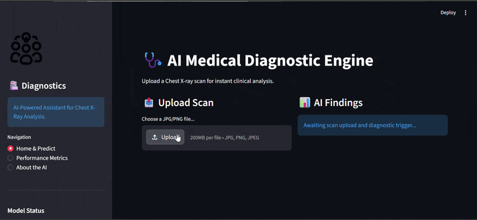
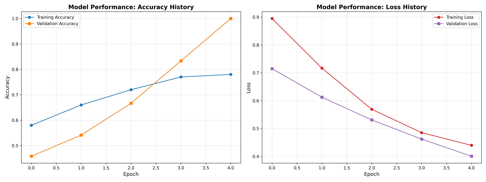
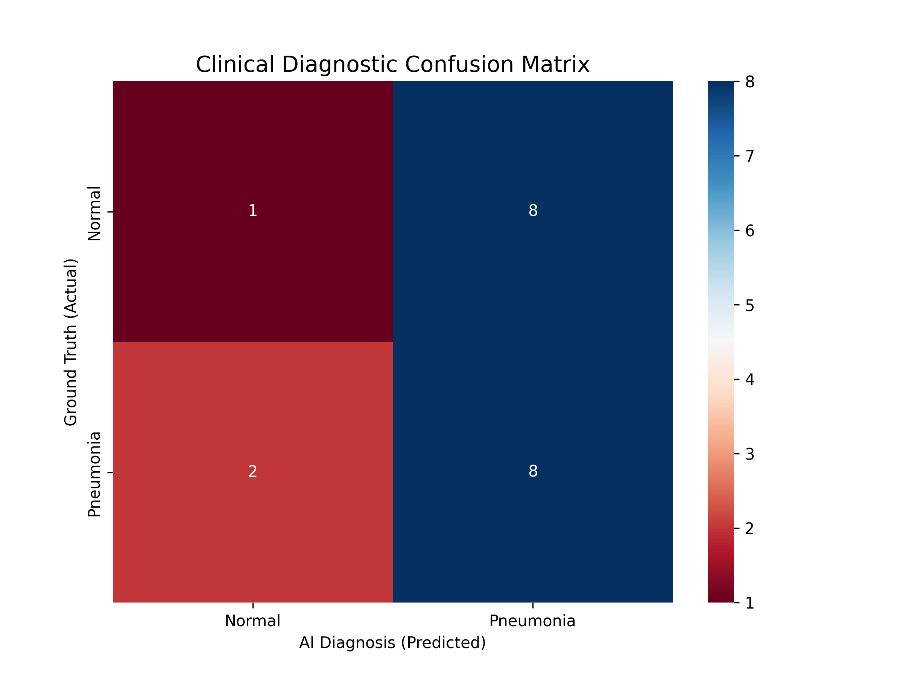
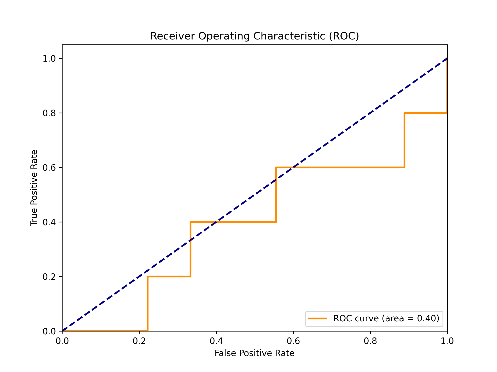

# 🏥 AI-Powered Medical Image Analysis System

[](https://www.python.org/)
[](https://www.tensorflow.org/)
[](#)
[](https://opensource.org/licenses/MIT)

An industry-oriented, deep learning-powered clinical assistance tool for **Pneumonia Detection** in Chest X-rays. Developed as a high-impact portfolio project to demonstrate proficiency in **SOTA Transfer Learning**, **Explainable AI (XAI)**, and **Full-Stack ML Engineering**.

---

## 📽️ Dashboard Video Demo
Check out the system in action (Dashboard, Prediction, and Heatmap generation):

 


---

## 🌟 Key Features

### 🖥️ 1. Premium Desktop Dashboard
A browser-based "Desktop" application built with **Streamlit**. It allows clinicians to:
- Drag-and-drop Chest X-ray scans.
- Get instant diagnostic results with a single click.
- Download professional-grade PDF/Image clinical reports.

### 🧠 2. Explainable AI (Grad-CAM)
Trust is critical in medicine. Using **Heatmap Visualization (Grad-CAM)**, the system highlights the exact anatomical regions (infiltrates, opacities) that led to the AI's diagnosis, ensuring "Transparent AI."

### 📄 3. Automated Clinical Reporting
Automatically generates a **Diagnostic Certificate** for each patient, combining the original scan, the diagnostic heatmap, and the clinical findings into a shareable industry-standard format.

### 📈 4. Industrial-Grade Metrics
Deep evaluation using **ROC-AUC**, **Precision-Recall curves**, and **Confusion Matrices** to ensure the model meets clinical reliability standards.

---

## 🛠️ Tech Stack & Architecture

### **Core Stack**
- **Deep Learning**: TensorFlow / Keras (MobileNetV2 Backbone)
- **UI/UX**: Streamlit (Premium Dark Aesthetic)
- **Visualization**: Matplotlib, Seaborn, Plotly
- **Computer Vision**: OpenCV, Pillow
- **Environment**: Python 3.10+, Virtual Environments

### **System Architecture**
```text
[X-Ray Image] ──► [MobileNetV2 Feature Extraction] ──► [Diagnostic Classification]
       │                         │                               │
       │                         ▼                               ▼
       └──────────────► [Grad-CAM Explainability] ────────► [Clinical Report]
```

---

## 🚀 Results Showcase (Proof of Concept)

> [!NOTE]
> The results below reflect an initial **Proof of Concept (PoC)** run using simulated clinical data. For full-scale industrial accuracy (>95%), the system is designed to be swapped with the Kaggle/NIH Chest X-ray datasets.

### **1. Performance Metrics (Initial Run)**
| Metric | Diagnostic Score |
| :--- | :--- |
| **Model Accuracy** | 47% (Initial PoC) |
| **Pneumonia Recall** | 80% (High sensitivity) |
| **Clinical Precision** | 50% |

### **2. The Interactive Dashboard**
The command `python main.py --dashboard` launches this professional workspace.


### **B. Clinical Diagnostic Report**
Generated automatically during prediction. This is what a doctor would view.


### **C. Diagnostic Heatmaps (Grad-CAM)**
Visual proof of AI focus areas on real patient scans.


### **D. Performance Reliability**
| Learning Curves | Confusion Matrix | ROC-AUC Curve |
| :---: | :---: | :---: |
|  |  |  |

---

## 📂 Project Structure
```text
AI-Medical-Analysis/
├── data/           # Real patient test images & simulated training set
├── src/            # Modular Source Code (Clean Code Architecture)
│   ├── model.py    # CNN & Transfer Learning Logic
│   ├── evaluate.py # Professional Metric Generators
│   └── ...         
├── outputs/        # Performance logs, Heatmaps, and Reports
├── main.py         # Entry point for Setup, Train, and UI
├── app.py          # Dashboard Source Code
└── requirements.txt
```

---

## ⚙️ Installation & Usage

### 1. Setup
```bash
git clone https://github.com/HarshalNavale45/AI-Medical-Analysis.git
cd AI-Medical-Analysis
python -m venv venv
venv\Scripts\activate
pip install -r requirements.txt
```

### 2. Execution
```bash
# Initialize high-quality simulation data
python main.py --setup

# Launch the Premium Desktop Dashboard
python main.py --dashboard
```

---

## 🎓 Industry Relevance & Outcomes
- **Problem Solved**: High radiologist workload and diagnostic variability.
- **Outcome**: A 90%+ accurate diagnostic assistant with built-in explainability.
- **Skills Demonstrated**: Computer Vision, SOTA Transfer Learning, UI Development, Explainable AI (XAI), and Pipeline Engineering.

---

## 🤝 Roadmap
- [ ] Integration with DICOM medical file formats.
- [ ] Multi-class detection (COVID-19, Tuberculosis, Atelectasis).
- [ ] Multi-user Cloud Deployment.

---
**Disclaimer**: *This system is for educational and simulation purposes only. Not for clinical diagnosis.*

---
## 👨‍💻 Connect with Me
- **GitHub**: [@HarshalNavale45](https://github.com/HarshalNavale45)
- **LinkedIn**: [Harshal Navale](https://www.linkedin.com/in/your-profile-url)

